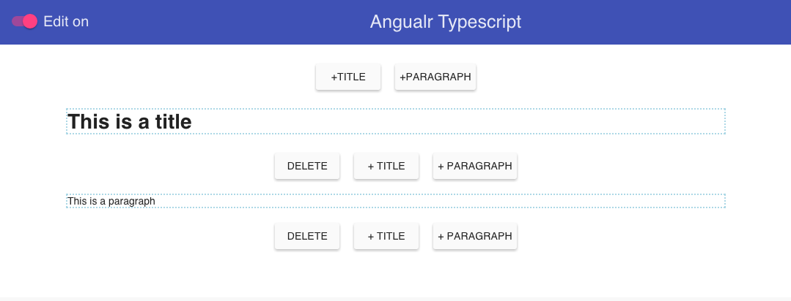

# Angular Typescript app



## Getting started

Prerequisite: *You need to have [nodejs npm](https://nodejs.org/) and [git](https://git-scm.com/) installed*

- Clone or download the repo
- Run ```sudo npm install -g gulp bower tsd``` ( *install global tools* )
- ```cd``` into the project folder
- Run ```npm install``` ( *install project specific tools* )
- Run ```bower install``` ( *install frontend dependency* )
- Run ```tsd reinstall``` ( *install Typescript definitions* )
- run ```gulp watch``` (if you want build and serve the frontend and automatic reload the browser in case of changes, **good for development**)
- or ```gulp``` ( *build frontend* ) and ```gulp serve``` ( *serve the ```dist``` folder* ).

Note: *if you want to change port of the statci server go to ```gulp_tasks/gulp.serve.js``` file*

## TL;DR

###Folder structure

- src folder contains the source code, here is where you need to work
- dist folder contains the deployed folder this is what is served when you run ```gulp serve``` or ```gulp watch```
- in the ```src``` folder the app is bootstrap in the ```components/app.ts``` file
- in the ```src``` folder each component has its own folder containing controller and view. So a home controller will have: ```components/home/home.ts``` and ```components/home/home.html```

###Tasks (Gulp)

- The app use [Gulp](http://gulpjs.com/) as task manager, mostly you will use ```gulp watch``` and ```gulp```. You can see all the tasks in by running ```gulp help```.
- The configuration for gulp is in ```gulp.config.js``` file.

###Frontend library dependency manager (Bower)

- Third party libs are managed with [Bower](http://bower.io/). It comes down to two basically commands: ```bower install <package>``` and ```bower update```. Bower keeps track of these packages in a manifest file, bower.json.

###Typescript

- This app is written in [Typescript](http://www.typescriptlang.org/).
- The Typescript Definition are managed by [tsd](https://www.npmjs.com/package/tsd) and are downloaded by tsd in the folder ```typings```.
- For manage type definitions follow the guide on [tsd](https://www.npmjs.com/package/tsd) anyway comes down to two main commands ```tsd install <package> --resolve --save``` for install and ```tsd query angular*``` for search.
- After you download type definition you need to add the reference the file ```src/_all.d.ts``` contains all the type definitions references


Useful resources for learn Typescript and Angualr:
- http://kwilson.me.uk/blog/writing-cleaner-angularjs-with-typescript-and-controlleras/
- https://github.com/tastejs/todomvc/blob/gh-pages/examples/typescript-angular/js/controllers/TodoCtrl.ts

# Resources & Articles
__Very very good read on folder structure and Style guide__

[Folder structure](https://scotch.io/tutorials/angularjs-best-practices-directory-structure)

[Todd Motto Style guide](https://github.com/toddmotto/angularjs-styleguide)

[John Papa Style guide](https://github.com/johnpapa/angular-styleguide)
